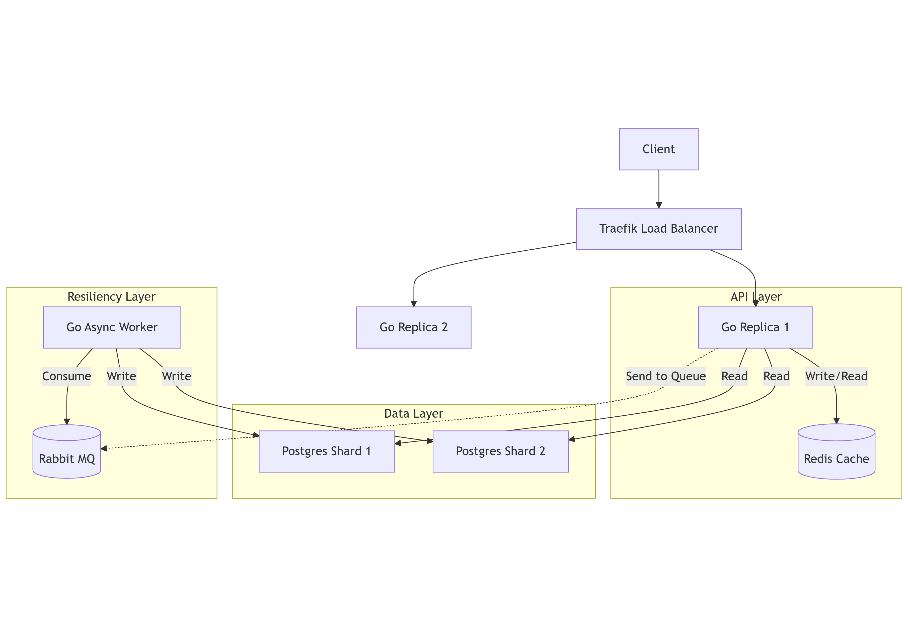

# URL-shortener

Main goals:

- [x] multiple backends
- [x] sharded database
- [ ] k8s managing everything
- [x] one redis for cache
- [x] traefik for load balancing
- [x] queue for insert
- [x] dlq
- [ ] some logger

